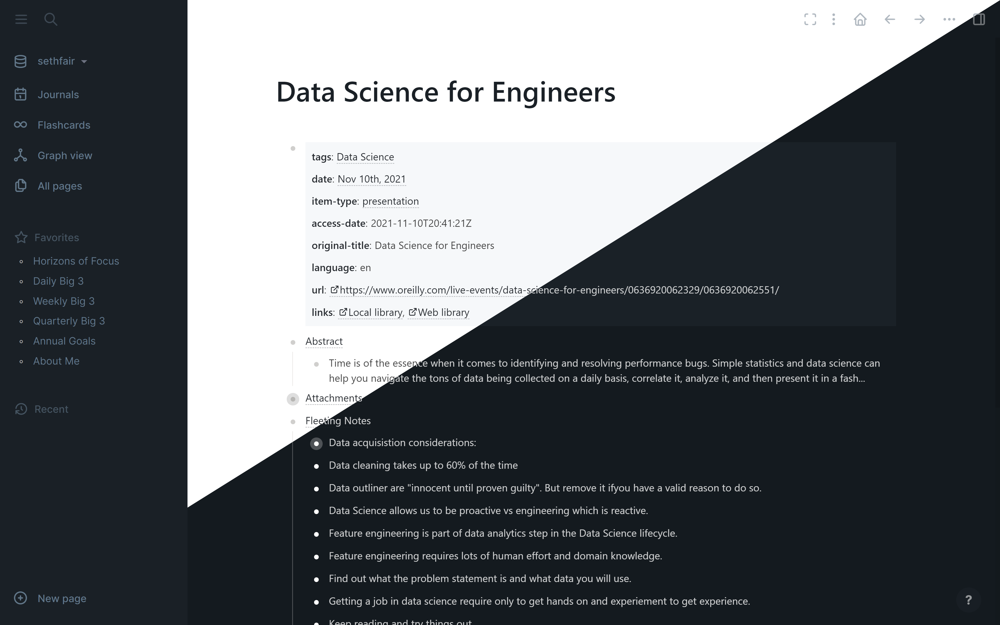

## Atlas Theme for Logseq

Atlas theme provides a pure and distraction-free experience with always a dark sidebar.

## What is Logseq?
Logseq is a privacy-first, open-source knowledge base.  Visit https://logseq.com/ for more information.

## Settings
You can customize the following parameters in your `custom.css` file to define the font and line height in the main content area.
```
:root {
  --atlas-line-height: 2em;
  --atlas-font-size: 0.95em;
  --atlas-font-family: "Segoe UI,Roboto,sans-serif";
}
```

## Install by copying
1. Copy the contents in https://raw.githubusercontent.com/sethfair/logseq-atlas-theme/main/custom.css
2. Paste the contents in your custom.css

## Install as a Plugin
* download from github to a local directory
* turn on developer mode
  * click the three dots in the upper right corner
  * click on the three goto settings
  * advanced
  * toggle on developer mode
* add plugin
  * click the three dots in the upper right corner
  * click on plugins
  * click on Load unpacked plugin
  * find your folder you downloaded for logseq-atlas-theme
* activate theme
  * click the three dots in the upper right corner
  * click on themes
  * select Atlas Theme: Light or Atlas Theme: Dark

## License

[MIT License](./LICENSE)
